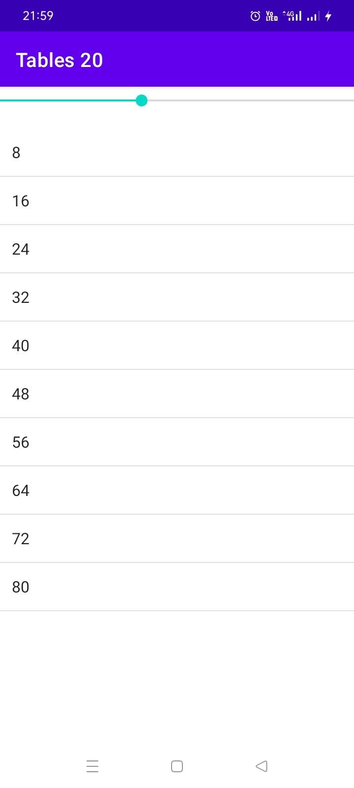

# <h1 align="center">Tables20 App</h1>
<table>
    <thead>
        <tr>
          <th colspan="3"><b>Screenshots</b></th>
        </tr>
    </thead>
    <tbody>
        <tr>
            <td></td>
            <td></td>
            <td></td>
        </tr>
    </tbody>
</table>

